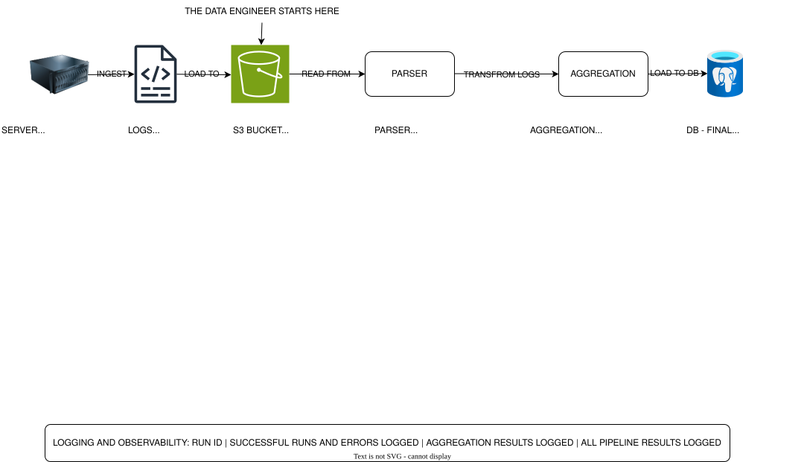

# Log Processing Pipeline — Server Logs → PostgreSQL Metrics

A production-style batch pipeline that reads raw server logs from AWS S3, parses unstructured Apache/Nginx log lines into structured events using regex, computes hourly performance and security metrics, and loads aggregated results into a PostgreSQL database for dashboard consumption.

---

## Problem Statement

Server logs are the most information-dense data source in any software system — every request, every error, every slow response is recorded. But raw log files are unstructured text. You cannot query them directly. Without a processing pipeline, engineering teams find out about performance degradation and error spikes when customers complain, not when the problem starts.

This pipeline solves three problems that did not exist in Projects 1 and 2:

**Unstructured data processing.** Unlike CSV (structured) or JSON (semi-structured), server logs have no schema. Structure must be extracted from raw text using regex pattern matching. A single malformed character makes a line unparseable. The pipeline handles this gracefully without halting.

**Two-layer metrics architecture.** Raw logs are preserved in S3 (Bronze layer) for auditing and reprocessing. Aggregated metrics are stored in PostgreSQL (Gold layer) for fast dashboard queries. Both layers serve different consumers with different needs.

**Operational visibility.** The pipeline produces hourly metrics per endpoint per status category — request volume, error rate, average response time, and P95 response time. These metrics are the foundation of any engineering team's observability stack.

---

## Architecture





**S3 Folder Structure:**
```
s3-bucket/
└── raw-logs/
    └── year=2024/
        └── month=01/
            └── day=15/
                └── server.log
```

**PostgreSQL Tables:**
```
hourly_metrics   ← Gold layer: aggregated performance metrics
rejected_logs    ← Dead letter: malformed lines with rejection reasons
top_ips          ← Security: daily top IP addresses by request volume
alembic_version  ← Schema version tracking
```

---

## Tech Stack

| Tool | Role | Why |
|---|---|---|
| Python `re` | Log line parsing | Regex-based extraction of structure from unstructured text — the core parsing mechanism |
| pandas | Data transformation and aggregation | DataFrame groupby operations for hourly metric computation |
| numpy | Statistical computation | `numpy.percentile` for P95 response time calculation |
| boto3 | S3 interaction | Official AWS SDK — reads raw log files from S3 Bronze layer |
| SQLAlchemy | Database ORM and connection management | Parameterized queries, connection pooling, engine abstraction |
| Alembic | Database schema migration | Versioned, auditable schema changes — new metric columns tracked across environments |
| psycopg2 | PostgreSQL driver | Production-grade PostgreSQL adapter for Python |
| python-dotenv | Credentials management | AWS and database credentials isolated from source code |
| Docker | PostgreSQL environment | Reproducible local database — identical setup across developer machines |

---

## Project Structure

```
log_pipeline/
├── alembic/
│   ├── versions/            # migration files — one per schema change
│   └── env.py               # alembic runtime configuration
├── config/
│   └── config.yaml          # log format regex, aggregation settings, S3 config
├── data/
│   └── generate_logs.py     # synthetic log generator for development and testing
├── models/
│   └── tables.py            # SQLAlchemy table definitions — source of truth for schema
├── src/
│   ├── ingest.py            # reads raw log file from S3
│   ├── parser.py            # regex parsing, two-mode failure handling, dead letter
│   ├── aggregator.py        # hourly metric computation, P95, top IP analysis
│   └── load.py              # three idempotency strategies across three tables
├── logs/                    # pipeline run logs (auto-created, named by run_id)
├── docker-compose.yml       # PostgreSQL container definition
├── .env                     # credentials (never committed)
├── .gitignore
└── main.py                  # orchestrator and entry point
```

---

## Setup

**Prerequisites:** Python 3.11+, uv, Docker Desktop, AWS account with S3 access

**1. Clone the repository**
```bash
git clone <repo-url>
cd log_pipeline
```

**2. Start PostgreSQL**
```bash
docker-compose up -d
```

**3. Install dependencies**
```bash
uv install
```

**4. Configure credentials**
```bash
cp .env.example .env
```

Edit `.env`:
```
DB_USER=pipeline_user
DB_PASSWORD=pipeline_pass
DB_HOST=localhost
DB_PORT=5432
DB_NAME=pipeline_db
AWS_ACCESS_KEY_ID=your_key
AWS_SECRET_ACCESS_KEY=your_secret
AWS_REGION=us-east-1
S3_BUCKET=your-bucket-name
```

**5. Run database migrations**
```bash
alembic upgrade head
```

**6. Generate synthetic log data**
```bash
uv run data/generate_logs.py
```

**7. Upload logs to S3**
```bash
aws s3 cp data/logs/server_$(date -d yesterday +%Y-%m-%d).log \
  s3://your-bucket/raw-logs/year=$(date -d yesterday +%Y)/month=$(date -d yesterday +%m)/day=$(date -d yesterday +%d)/server.log
```

**8. Run the pipeline**
```bash
uv run main.py
```

**Manual backfill for a specific date:**
```python
from main import run_pipeline
from datetime import date
run_pipeline(target_date=date(2024, 1, 15))
```

---

## Verifying Results

Connect to PostgreSQL and run verification queries:

```bash
docker exec -it csv_pipeline_db psql -U pipeline_user -d pipeline_db
```

```sql
-- Metrics loaded correctly
SELECT window_start, endpoint, status_category,
       request_count, error_rate, avg_response_ms, p95_response_ms
FROM hourly_metrics
ORDER BY window_start, endpoint
LIMIT 10;

-- Expected: rows with 24 distinct window_start values,
-- one per hour, across all endpoints and status categories

-- Rejection breakdown
SELECT rejection_reason, COUNT(*)
FROM rejected_logs
GROUP BY rejection_reason
ORDER BY COUNT(*) DESC;

-- Expected: pattern_mismatch, empty_line, invalid_field variants

-- Top IPs — detect suspicious traffic
SELECT ip, request_count, unique_endpoints
FROM top_ips
ORDER BY request_count DESC
LIMIT 5;

-- Idempotency test — run pipeline twice, counts should be identical
SELECT COUNT(*) FROM hourly_metrics;
SELECT COUNT(*) FROM rejected_logs;
```

**Pipeline summary log** (what a healthy run looks like):
```
LOG PIPELINE COMPLETE
  Run ID           : a3f2b1c4
  Target date      : 2024-01-15
  Duration         : 8.43s
  Lines ingested   : 14790
  Lines parsed     : 14500
  Lines rejected   : 290 (2.0%)
  Metric rows      : 312
  Top IPs tracked  : 10
  Endpoints tracked: 10
  Windows tracked  : 24
```

Rejection rate is the key health metric. A sudden spike above baseline (normally ~2%) indicates a log format change or upstream data quality problem requiring immediate investigation.

---

## Key Design Decisions

See `DOCUMENTATION.md` for full reasoning. Summary:

- **Regex pattern in config** — log format is configuration, not code. Format changes require one YAML edit, no Python changes
- **Two parser failure modes** — pattern mismatch (format problem) vs invalid field (semantic problem) point to different root causes requiring different investigations
- **Three idempotency strategies** — upsert for metrics, WHERE NOT EXISTS for rejected logs, delete-then-insert for top IPs. Each matches the semantic requirements of its table
- **S3 as Bronze layer** — raw logs preserved before any transformation for auditing, debugging, and reprocessing
- **Alembic for schema management** — metrics tables evolve as monitoring requirements grow. Every change versioned and auditable
- **Aggregation granularity** — one row per window × endpoint × status category gives maximum query flexibility for dashboards

---

## What I Would Do Differently in Production

**Orchestration** — replace manual execution with Apache Airflow. Each pipeline stage becomes a DAG task with retries, backfill UI, SLA alerting, and dependency management.

**Scale** — replace single-threaded line-by-line parsing with chunked processing using `multiprocessing` or PySpark for log volumes above ~1M lines per day. At 10x current volume the sequential parser becomes the bottleneck.

**Anomaly detection** — replace the fixed rejection rate threshold with dynamic alerting based on rolling 7-day baseline. Alert when rejection rate exceeds 2-3 standard deviations above historical average.

**Query layer** — add AWS Athena pointed at the S3 raw logs for ad-hoc investigation. When an incident occurs, analysts need to query raw logs directly — not just aggregated metrics.

**Schema evolution** — add `sample_size_warning` boolean column to `hourly_metrics` flagging windows with fewer than 20 requests where P95 is statistically unreliable.

**Secrets management** — replace `.env` files with AWS Secrets Manager. Credentials rotate automatically and are never stored on developer machines.